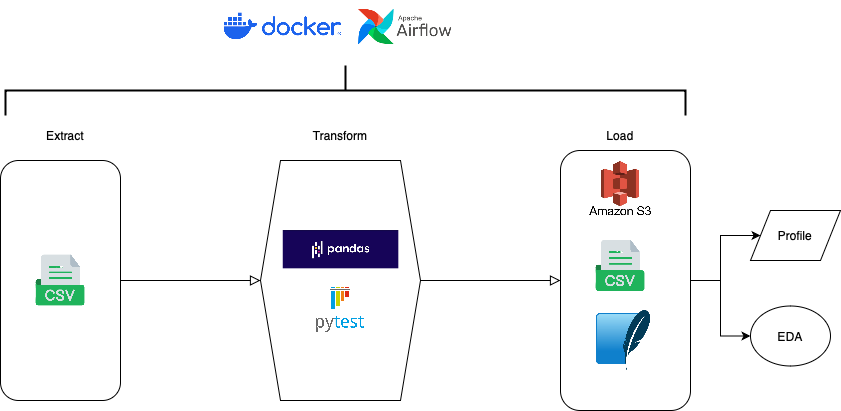

# BrokerChooser ETL Pipeline

## 📌 Overview
This project is a modular, cloud-ready **ETL pipeline** built for BrokerChooser as part of a data engineering assessment. The goal was to build a robust, scalable, and easily testable data pipeline that can unify internal user conversion data with broker data for more effective product analysis and decision-making.

---

## 🛠 Stack & Architecture

| Component         | Purpose                                                                      |
|------------------|-------------------------------------------------------------------------------|
| **Python**        | Core scripting language for ETL logic                                         |
| **Airflow**       | Orchestrates the DAG (extract → transform → load → profile) with visibility   |
| **Docker**        | Isolates the environment for local development and future CI/CD portability   |
| **S3**            | Serves as a scalable, cloud-native destination for final datasets             |
| **SQLite**        | Simple local database format for lightweight querying                         |
| **YData Profiling** | Fast, automated exploratory data analysis                                     |
| **Pytest**        | Unit testing to validate transformations and data integrity                   |

---

## 🔄 ETL Flow Diagram


---

## 📊 Pipeline Breakdown

### 1. **Extract**
- Ingests CSV files using patterns to support batch loads.
- Normalizes date formats and delimiter types.
- Ensures critical columns are present before proceeding.

### 2. **Transform**
- Cleans and harmonizes country names using a YAML-based mapping.
- Matches broker data to user conversions by timestamp proximity.
- Categorizes unmatched records and exports diagnostics for investigation.

### 3. **Load**
- Saves output to:
  - CSV (flat file)
  - SQLite (lightweight local DB)
  - AWS S3 (cloud storage for scale & accessibility)

### 4. **Profile**
- Uses YData Profiling to generate an interactive HTML report.
- Helps quickly identify missing data, distributions, and correlation patterns.

---

## 🔁 Scalability & Cost Considerations

This pipeline is designed to be modular and portable. Each stage can be scaled independently, whether for more compute power, batch frequency, or output destinations.

### 🧩 Modular Design Benefits
- Tasks can be re-ordered, removed, or triggered independently.
- Suitable for extension into event-driven or micro-batch processing.

### 💰 Estimated Cloud Storage Cost (S3)

Assuming an average row size of 1 KB:

| Rows         | Approx Size | Monthly Cost (S3 Standard) |
|--------------|-------------|-----------------------------|
| 100,000      | ~100 MB     | ~$0.0023                    |
| 1,000,000    | ~1 GB       | ~$0.023                     |
| 10,000,000   | ~10 GB      | ~$0.23                      |
| 100,000,000  | ~100 GB     | ~$2.30                      |

> These are raw storage costs. Read/write requests and transfer costs would be additional but minimal for this use case.

### ⚙️ Runtime Cost (Airflow via MWAA)

When deployed using Amazon MWAA (Managed Airflow):

| Frequency     | Runtime/Month | Estimated Monthly Cost (MWAA + EC2) |
|---------------|----------------|--------------------------------------|
| Daily         | ~2.5 hours     | $20–30                                |
| Hourly        | ~30 hours      | $60–100                               |
| Event-based   | Varies         | Lower (with Lambda or Step Functions) |

> If cost is a concern, consider moving smaller steps (e.g. load or profiling) to AWS Lambda functions or even AWS Glue jobs for more cost efficiency.

---

## 🤔 Addressing Common Engineering Questions

**Q1: What if the schema changes unexpectedly?**  
The pipeline uses defensive programming and schema validation via Pytest. In production, Great Expectations or Pandera could be added to enforce schema contracts and flag drift.

**Q2: Can this scale to millions of rows per day?**  
Yes. The pipeline is modular, and all data operations can be rewritten using Dask or Spark if needed. The current batch pipeline handles mid-volume data comfortably.

**Q3: What happens if a task fails?**  
Airflow logs detailed tracebacks and supports retries, alerts, and SLA monitoring. Each task is wrapped in try/except for debugging. Email or Slack alerts can be easily added.

**Q4: Is it secure to store AWS credentials in a file?**  
For demo purposes, `aws.env` is used. In production, credentials should be injected securely via IAM roles, AWS Secrets Manager, or environment bindings in CI/CD.

---

## ▶️ How to Run It

```bash
# Start the stack
docker compose up --build

# Access Airflow
Visit http://localhost:8080 (user: airflow, pass: airflow)

# Trigger the DAG
Run the DAG manually or on a schedule
```

Outputs:
- `output/final_output.csv`
- `output/matched_data.sqlite`
- `output/profiling_report.html`
- S3 upload to: `s3://<bucket>/matched_data.csv`

---

## 📁 Project Structure
```
brokerchooser-etl/
├── etl/
│   ├── extract.py
│   ├── transform.py
│   ├── load.py
│   ├── profiling_task.py
│   └── aws.env
├── dags/
│   └── brokerchooser_dag.py
├── tests/
│   └── test_transform.py
├── requirements.txt
├── docker-compose.yml
├── Dockerfile
├── regions.yml
└── output/
```

---

## 🧠 Why These Tools?
| Tool             | Reason                                                                 |
|------------------|------------------------------------------------------------------------|
| **Airflow**       | Flexible, production-ready orchestration with dependency handling     |
| **Docker**        | Makes local testing and cloud migration seamless                      |
| **S3**            | Cheap, durable cloud storage with API access                          |
| **YData Profiling** | Saves hours of manual data exploration                               |
| **Pytest**        | Prevents silent errors by checking assumptions on input/output data   |

---

## 📌 Final Notes

This project delivers a modular, testable, and cloud-adaptable pipeline suitable for production with minimal adjustments. Each component is isolated for clarity, and the whole system is compatible with modern orchestration and CI/CD pipelines.

**Next Steps:**
- Optionally integrate with AWS Lambda for serverless triggers
- Add CI to automatically run Pytest and DAG checks on commits
- Monitor costs more granularly using CloudWatch if deployed on AWS

---

**Author**: Andras Tuu 
**Date**: April 2025  
**Contact**: www.linkedin.com/in/andrás-tűű-99a0b61bb

